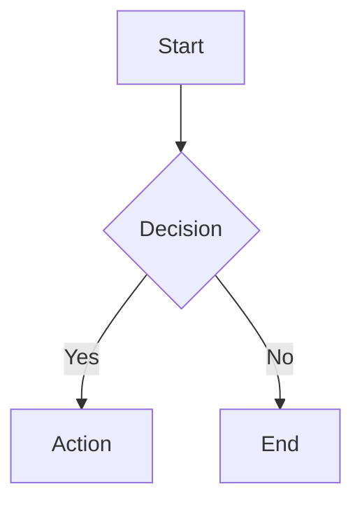

The key words "MUST", "MUST NOT", "REQUIRED", "SHALL", "SHALL NOT", "SHOULD",
"SHOULD NOT", "RECOMMENDED", "MAY", and "OPTIONAL" in this document are to be
interpreted as described in RFC 2119.

# Documentation Workflow

## Tool Grid

| Task | Tool | Command |
|------|------|---------|
| Lint | markdownlint | `npx markdownlint-cli2 "**/*.md"` |
| Format | Prettier | `npx prettier --write "**/*.md"` |
| Link check | markdown-link-check | `npx markdown-link-check README.md` |

## Markdown Standards

### Line Length

- Line wrap at 80 characters (RECOMMENDED)
- Exceptions: URLs, code blocks, tables

### Headings

- ATX-style headings MUST be used (`#` syntax, not underlines)
- Single H1 per document (REQUIRED)
- No skipped heading levels (SHOULD NOT skip from H2 to H4)
- Blank line before and after headings (REQUIRED)

### Lists

- 4-space nesting for sub-items (REQUIRED)
- Consistent marker style within document (SHOULD)

```markdown
- First item
    - Nested item (4 spaces)
- Second item
```

### Code Blocks

- Fenced code blocks MUST specify language
- Use triple backticks, not indentation

### Links and References

- Prefer reference-style links for repeated URLs
- Relative paths for internal docs (RECOMMENDED)
- Check links in CI (SHOULD)

## Mermaid Diagrams

Mermaid diagrams are RECOMMENDED for version-controlled visual documentation.

- Version controlled alongside code
- No external image dependencies
- Renders in GitHub, GitLab, and most Markdown viewers



Common types: `flowchart`, `sequenceDiagram`, `classDiagram`, `erDiagram`,
`gantt`, `stateDiagram-v2`

Best practices:

- Keep diagrams simple (SHOULD NOT exceed 20 nodes)
- Test rendering before committing

## Specification Types

### RFCs (Request for Comments)

Purpose: Consensus-requiring proposals for significant changes.

```markdown
# RFC-XXXX: Title

## Status
Draft | Review | Accepted | Rejected | Superseded

## Summary | ## Motivation | ## Detailed Design | ## Alternatives | ## Open Questions
```

### ADRs (Architecture Decision Records)

Purpose: Document architectural decisions and their context.

**ADRs MUST NOT be deleted, only superseded** by newer ADRs.

```markdown
# ADR-XXXX: Title

## Status
Proposed | Accepted | Deprecated | Superseded by ADR-YYYY

## Context | ## Decision | ## Consequences
```

Location: `docs/adr/` or `docs/architecture/decisions/`

### Design Docs

Purpose: Implementation blueprints for features or systems.

Sections: Overview, Background, Technical Design, Security Considerations,
Testing Strategy, Rollout Plan.

## YAML Frontmatter

Metadata SHOULD be included in YAML frontmatter:

```yaml
---
title: Document Title
author: Name
date: 2025-01-15
status: draft | review | published
tags: [api, architecture]
---
```

## Cross-References and Linking

### Internal Links

- Use relative paths from document location
- Link to specific headings with anchors

```markdown
See [Installation](./docs/install.md#prerequisites)
```

### External Links

- HTTPS URLs only (REQUIRED)
- Consider link permanence (prefer official docs over blog posts)

### Anchor Generation (GitHub/GitLab)

Lowercase, spaces become hyphens, remove punctuation except hyphens.
Example: `## API Design Patterns` becomes `#api-design-patterns`

## CI Validation

Documentation SHOULD be validated in CI pipelines.

```yaml
# .github/workflows/docs.yml
name: Docs
on: [push, pull_request]
jobs:
  lint:
    runs-on: ubuntu-latest
    steps:
      - uses: actions/checkout@v4
      - run: npx markdownlint-cli2 "**/*.md"
      - run: npx markdown-link-check README.md
```

Configuration (`.markdownlint.json`):

```json
{ "default": true, "MD013": { "line_length": 80 }, "MD033": false }
```

## README Structure

Project README files SHOULD follow this structure:

1. **Title** - Project name
2. **Badges** - Build status, coverage, license (OPTIONAL)
3. **Description** - One-line summary
4. **Installation** - Prerequisites and install commands
5. **Usage** - Quick start examples
6. **Documentation** - Links to detailed docs
7. **Contributing** - Link to CONTRIBUTING.md
8. **License** - License type and link

## File Organization

```
docs/
  adr/           # Architecture Decision Records
  rfcs/          # Request for Comments
  guides/        # User guides
  api/           # API documentation
README.md        # Project overview
CONTRIBUTING.md  # Contribution guidelines
CHANGELOG.md     # Version history
```

## Quick Reference

| Element | Rule |
|---------|------|
| Line length | 80 chars (RECOMMENDED) |
| Headings | ATX-style, no skips |
| List indent | 4 spaces |
| Code blocks | Fenced with language |
| Links | Relative for internal |
| ADRs | Never delete, supersede |
| Diagrams | Mermaid (RECOMMENDED) |
| Frontmatter | YAML metadata |
